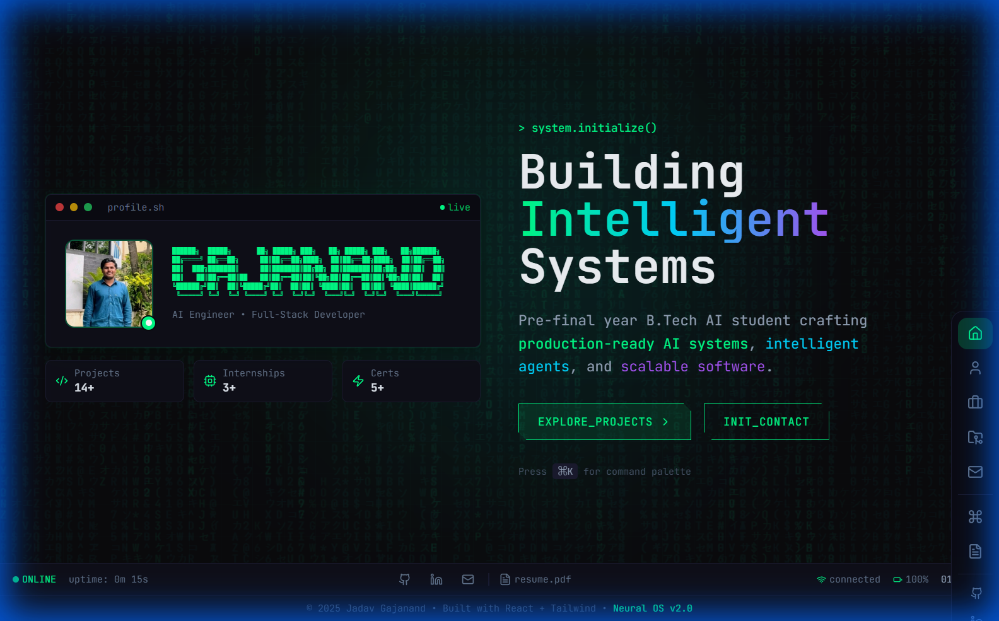
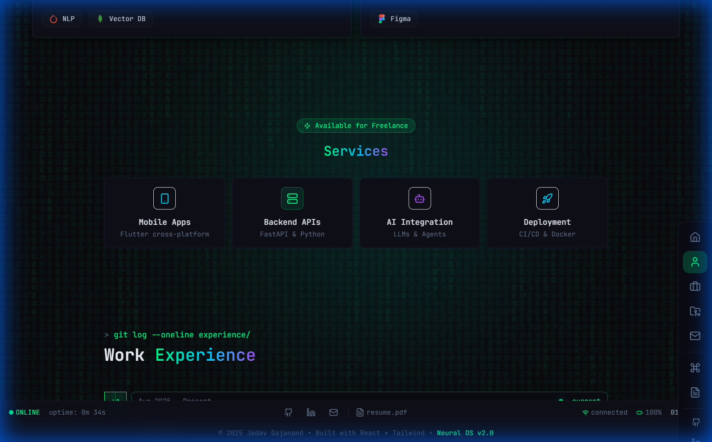
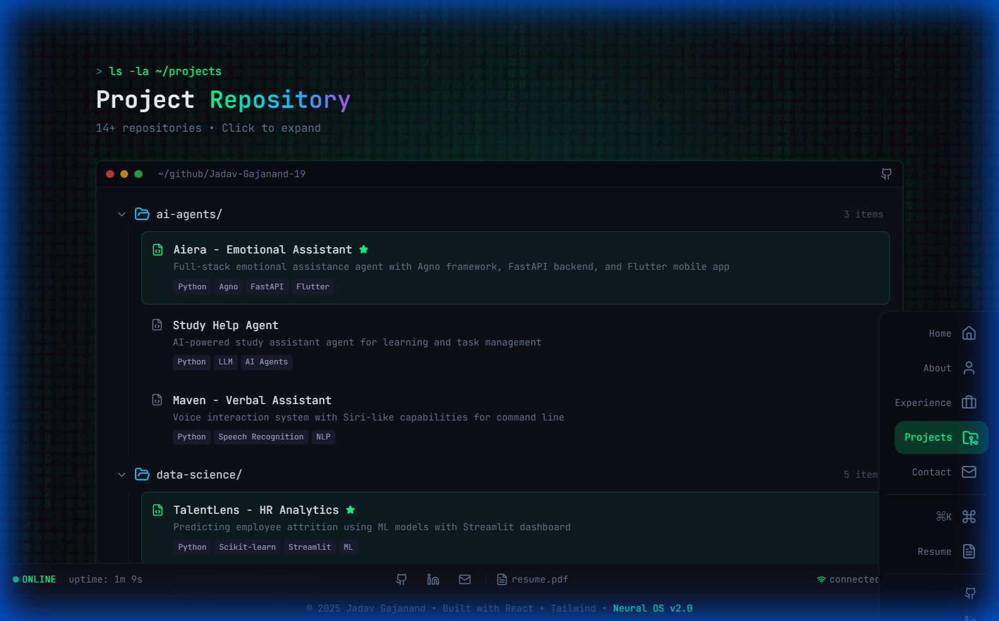
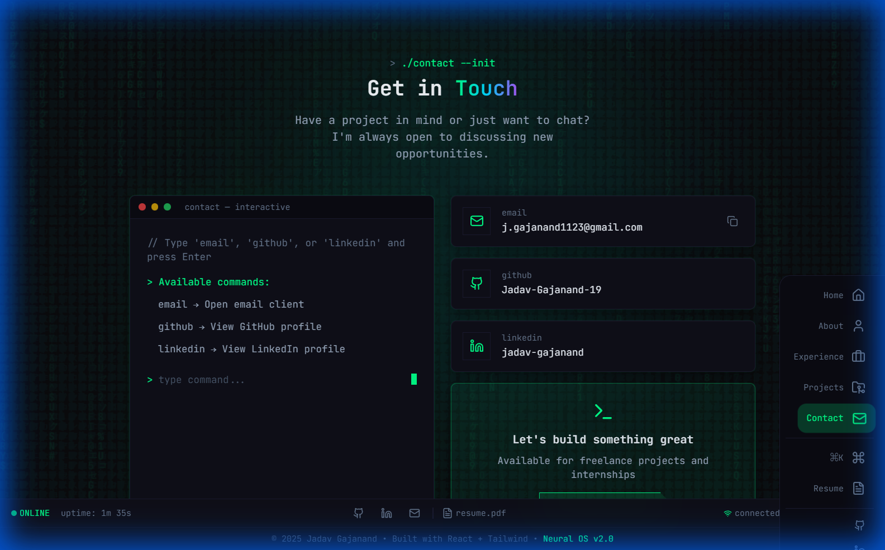

# 🚀 Neural Portfolio | Jadav Gajanand

A modern, cyberpunk-themed developer portfolio built with React, Vite, and Tailwind CSS. Features a unique "Neural OS" interface with terminal aesthetics, smooth animations, and fully responsive design.



## ✨ Features

- **🎨 Cyberpunk UI** - Unique terminal-inspired design with cyber-green accent colors
- **⚡ Fast & Optimized** - Built with Vite for lightning-fast load times
- **📱 Fully Responsive** - Mobile-first design with bottom navigation on phones
- **🎭 Smooth Animations** - Powered by Framer Motion
- **⌨️ Command Palette** - Quick navigation with `Ctrl+K`
- **🖥️ Boot Sequence** - Immersive loading animation

## 🖼️ Screenshots

### Skills & Services


### Projects Repository


### Contact Terminal


## 🛠️ Tech Stack

| Category | Technologies |
|----------|-------------|
| **Frontend** | React 18, Vite 6 |
| **Styling** | Tailwind CSS 3.4 |
| **Animations** | Framer Motion |
| **Icons** | Lucide React |
| **Deployment** | Vercel |

## 🚀 Quick Start

```bash
# Clone the repository
git clone https://github.com/Jadav-Gajanand-19/E-Portfolio.git

# Navigate to directory
cd E-Portfolio

# Install dependencies
npm install

# Start development server
npm run dev

# Build for production
npm run build
```

## 📁 Project Structure

```
E-Portfolio/
├── public/
│   ├── profile.jpg
│   └── resume.pdf
├── src/
│   ├── components/
│   │   ├── Hero.jsx
│   │   ├── Navbar.jsx
│   │   ├── BentoGrid.jsx
│   │   ├── Services.jsx
│   │   ├── Experience.jsx
│   │   ├── Projects.jsx
│   │   ├── Certifications.jsx
│   │   ├── Contact.jsx
│   │   └── StatusBar.jsx
│   ├── App.jsx
│   ├── main.jsx
│   └── index.css
├── screenshots/
└── package.json
```

## 🎯 Key Sections

- **Hero** - Introduction with ASCII art name and quick stats
- **About** - System overview with skills bento grid
- **Services** - AI/ML, Full-Stack, Mobile development capabilities
- **Experience** - Work timeline with internships
- **Projects** - Repository-style project showcase
- **Certifications** - Achievements and credentials
- **Contact** - Interactive terminal with command interface

## 📱 Mobile Responsive

The portfolio features a dedicated mobile navigation bar at the bottom, replacing the desktop sidebar for optimal mobile experience.

## 👤 Author

**Jadav Gajanand**
- 🎓 Pre-final year B.Tech AI Student
- 💼 AI Engineer & Full-Stack Developer
- 📧 j.gajanand1123@gmail.com
- 🔗 [LinkedIn](https://www.linkedin.com/in/jadav-gajanand-3aa946290)
- 🐙 [GitHub](https://github.com/Jadav-Gajanand-19)

## 📄 License

This project is open source and available under the [MIT License](LICENSE).

---

<p align="center">
  <b>⚡ Built with React + Tailwind • Neural OS v2.0 ⚡</b>
</p>
